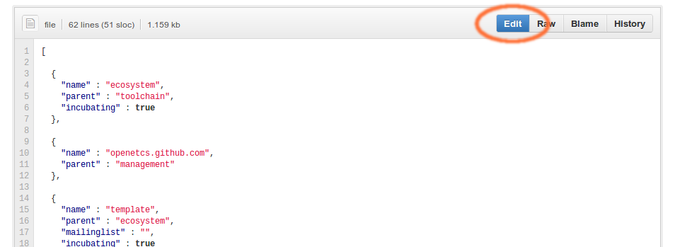
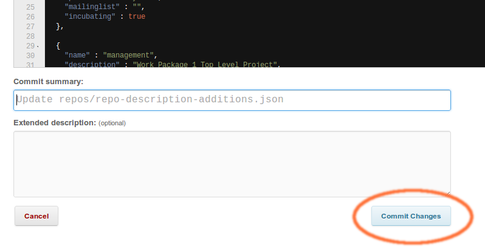
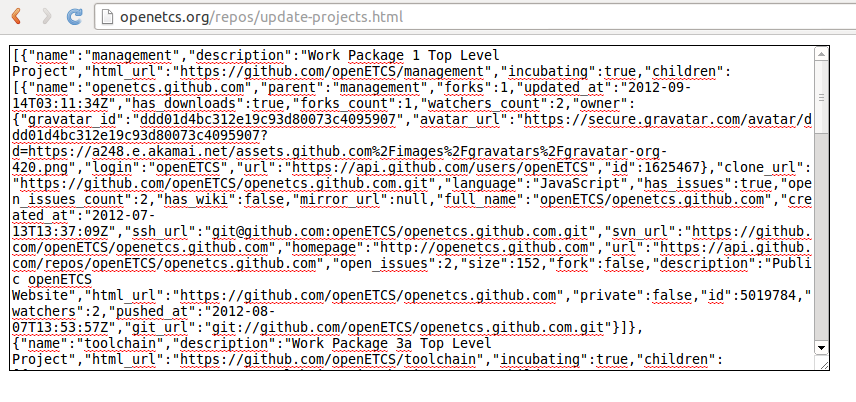

openETCS website documentation
==============================

Update project description
--------------------------

The project descriptions that can be viewed on www.openetcs.org/projects/ are located within the folder *repos*.

The folder contains three *JSON* files:

- **repo-description-github.json**:
	- contains automatically generated project information from github
- **repo-description-additions.json**
	- can be used to add additional descriptions to the project like "incubating" or "parent"
- **repo-description-merged.json**
	- both *repo-description-github.json* and *repo-description-additions.json* are merged into this file which is then used to display the project information on the website. If something changes in *repo-description-additions.json*, this file must be updated. Below is a detailed explanation of how to update this file and display the project information on the website.
	
### Add additional project information

To edit the project descriptions, open the file *repo-description-additions.json*. The file can be edited directly on github:

Each project description is surrounded by curly brackets { }:

	{
		"name" : "project name",
		"parent" : "name of the project where this sub-project belongs to
                   (needed to represent project hirarchy)"
		"description" : "project description",
		"private" : true or false,
		"incubating" : true or false,
		"has_wiki" : true or false,
		"open_issues_count" : 5,
		"mailinglist" : "http://www.link-to-mailing-list.com",
		"html_url" : "http://www.github.com/link/to/this/project"
	}
	
Most of the data is taken from the generated github file and does not have to be set manually. But "incubating", "mailinglist" and "parent" must be set manually if they need to appear on the website. All properties from *repo-description-github.json* can be overridden by *repo-description-additions.json*.

After updating the project descriptions hit **Commit Changes**:

### Generate and update *repo-description-merged.json*

Now the file *repo-description-merged.json* needs to be updated. To do so, open [this website](http://openetcs.org/repos/update-projects.html). Copy the generated data from the textfield (*right-click --> select all* and then *right-click --> copy*)

After copying the generated data, return to github.com and open the file *repo-description-merged.json*. Replace the old content by the newly generated data and hit **Commit Changes**.

The project data on http://openetcs.org/projects/ should now be updated.

